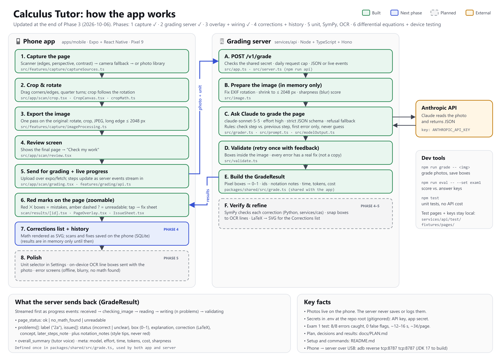

# Calculus Tutor

A React Native (Expo) app for iOS and Android. A student photographs a page of
college calculus work; the app marks mistakes in red on the photo and builds a
list of corrections, like a personal tutor. Correct work is left alone.

A personal project, not published to app stores. The test device is a
Google Pixel 9. The plan, decisions and phase details are in
[`docs/PLAN.md`](docs/PLAN.md).

**How it fits together:** [`app-diagram.png`](app-diagram.png) (source:
`app-diagram.svg`; regenerate with `npm run diagram`). It's updated at the end
of every phase.



**Status: all 8 phases done.** Scan or pick a page, crop it, tap "Check my work",
and the page comes back with red marks on mistakes; tap a mark for the
explanation and fix in real math notation. Fixes are double-checked by a math
engine (SymPy), and boxes are snapped to your handwriting. Every graded page is
saved on the phone: reopen it from History, and study all your mistakes in
Corrections. Pick your current unit in Settings. Differential equations are
checked too, including plugging solutions back into the equation. Tap
"Work out a problem step by step" to see any problem on the page solved one
step at a time, starting from where your work went off track. Settings shows
what you've spent today and this month.

| Phase | Scope | Status |
| --- | --- | --- |
| 1 | Scaffold, navigation, capture, crop/rotate | Done |
| 2 | Backend proxy, Claude vision call, JSON schema validation | Done |
| 3 | Red error overlay with tap-for-explanation | Done |
| 4 | Corrections list with math rendering, local history | Done |
| 5 | Unit selector, SymPy verification, box snapping, error states, hosting | Done |
| 6 | Differential equations support, on-device testing, known limitations | Done |
| 7 | Usage tracker (pages and dollars) and cost reduction | Done |
| 8 | Step-by-step tutor: work out a selected problem | Done |

## Repository layout

```
apps/mobile/                Expo app (TypeScript, Expo Router)
  src/app/                  Screens. Every file here is a route.
    (tabs)/                 Scan, Corrections, History, Settings tabs
    scan/crop.tsx           Crop & rotate
    scan/review.tsx         Final image before grading
  src/features/capture/     Scanner/camera/library capture, crop geometry, image export
  src/components/           Shared UI (Button, EmptyState)
  src/theme/                Light/dark color tokens
  src/config.ts             Image size and quality settings
packages/shared/            Zod schemas for the grading result, shared by app and server
services/api/               Grading server (Node/TypeScript, Hono, Anthropic SDK)
  src/prompt.ts             Grading instructions for Claude
  src/grader.ts             Claude call, validation, one retry on invalid output
  src/app.ts                HTTP API: POST /v1/grade (JSON or streamed progress)
  src/cas.ts                Runs the SymPy checker as a child process
  src/boxes.ts              Snaps the model's boxes to the ink on the page
  scripts/grade.ts          Command-line grader that saves annotated copies
  scripts/eval.ts           Scores the grader against answer keys
  scripts/make-de-pages.ts  Draws stand-in differential-equation test pages
  scripts/tutor.ts          Works out one problem from the command line
  src/tutor.ts              Step-by-step tutor: POST /v1/tutor
  test/fixtures/pages/      Test pages and answer keys (local only, gitignored)
services/cas/               Python SymPy checker (cas_worker.py) and its tests
Dockerfile                  Container image for hosting the server
```

## Prerequisites

- Node.js 20 or newer (developed on Node 22) and npm
- **iOS:** a Mac with Xcode to build locally, or an [Expo](https://expo.dev)
  account plus a paid Apple Developer account to build in the cloud with EAS
- **Android:** Android Studio (SDK + an emulator or a USB-debuggable phone) to
  build locally, or an Expo account to build with EAS

## Why a development build (not Expo Go)

The app uses one native module that isn't in Expo Go:
`react-native-document-scanner-plugin`. It wraps Apple's VisionKit scanner and
Google's ML Kit Document Scanner, which find the page edges, correct
perspective and clean up contrast. Everything else (camera, photo picker,
image manipulation, gestures) is a standard Expo module.

The app still runs in Expo Go for a quick look: "Scan a page" falls back to the
plain system camera, without edge detection.

## Setup

```sh
npm install                 # from the repo root (npm workspaces)
```

For Android, the placeholder app ID `com.example.calculustutor` is fine for
personal use. An iOS build needs a bundle identifier you own: change
`ios.bundleIdentifier` in `apps/mobile/app.json` first.

### iOS

**Local build (Mac with Xcode):**

```sh
cd apps/mobile
npx expo run:ios            # Simulator
npx expo run:ios --device   # plugged-in iPhone (pick your signing team in Xcode if asked)
```

The Simulator has no camera. Use "Choose from photos" there, and test
scanning on a real iPhone.

**Cloud build (EAS, no Mac needed):**

```sh
cd apps/mobile
npx eas-cli@latest login
npx eas-cli@latest device:create                          # register your iPhone once
npx eas-cli@latest build --profile development --platform ios
```

Install the build from the link EAS gives you, then start the bundler with
`npm run mobile` from the repo root and open the app.

### Android

**Local build (Android Studio installed):**

1. Install [Android Studio](https://developer.android.com/studio). Its setup
   wizard installs the Android SDK, platform tools and a JDK.
2. Set these user environment variables, then **open a new terminal** (open
   ones don't see the change). On Windows with default install locations:
   - `JAVA_HOME` = a **JDK 17** install, e.g. Eclipse Temurin 17 (this machine:
     `%LOCALAPPDATA%\Programs\Temurin\jdk-17`). Don't use the Java 25 that ships
     with Android Studio: React Native's C++ build step fails on it with
     "A restricted method in java.lang.System has been called".
   - `ANDROID_HOME` = `%LOCALAPPDATA%\Android\Sdk` (shown in Android Studio
     under Settings → Languages & Frameworks → Android SDK)
   - Add `%JAVA_HOME%\bin` and `%ANDROID_HOME%\platform-tools` to `Path`
3. On the phone (e.g. Pixel 9): Settings → About phone → tap **Build number**
   seven times. Then turn on Settings → System → Developer options → **USB
   debugging**.
4. Connect the phone by USB, accept the "Allow USB debugging?" prompt, and
   check that `adb devices` lists it.
5. Build, install and start the bundler:

```sh
cd apps/mobile
npx expo run:android --device   # USB-connected phone (first build takes 10–20 min)
npx expo run:android            # or an emulator
```

Later, when you've only changed JavaScript, run `npm run mobile` and open the
app on the phone. Rebuild only when native dependencies change.

Don't edit files in `apps/mobile/android/` by hand. That folder is generated
from `app.json` (and gitignored); if it gets out of sync, regenerate it with
`npx expo prebuild --platform android --clean` from `apps/mobile`. The Gradle
"problems report" lists deprecation warnings on every build; those aren't
errors. The real error is under "What went wrong" in the build output.

**Cloud build (EAS):**

```sh
cd apps/mobile
npx eas-cli@latest login
npx eas-cli@latest build --profile development --platform android
```

Install the APK from the EAS link, then run `npm run mobile` from the repo root
and open the app.

The Android scanner runs inside Google Play services, so it needs a device or
emulator image with Play services. The first scan may download the scanner
module.

## Grading server

Copy `.env.example` to `.env` in the repo root and fill in `ANTHROPIC_API_KEY`
and `API_SHARED_SECRET`. `.env` is gitignored.

The math checker needs Python 3.11+ with SymPy, in a virtual environment the
server finds automatically:

```sh
python -m venv services/cas/.venv
services/cas/.venv/Scripts/pip install -r services/cas/requirements.txt   # macOS/Linux: .venv/bin/pip
```

Without it the server still grades; fixes just aren't double-checked
(`CAS_PYTHON` can point at another Python).

```sh
npm run api                                   # dev server on http://localhost:8787
npm run grade -- path/to/photo.jpg            # grade photos (or a folder) from the command line
npm run eval -- --set exam1 --efforts high    # score against answers-exam1.md (also: --set de)
npm run tutor -- page.jpg --label 2a          # work out one problem step by step (~2¢)
```

`grade` and `eval` save each result's JSON and an annotated copy of the page
(red boxes for mistakes, amber dashed for unreadable steps) under
`services/api/out/`. Every graded page costs real money: about 2.5¢ for an
exam page and up to ~4¢ for a dense photo (`claude-sonnet-5-5`, high effort,
1568 px images, cached instructions). A step-by-step solution is about 2¢.

**Spending:** the server logs every request's tokens and estimated cost to
`services/api/data/usage.jsonl` (no images), shown in the app under Settings →
Usage. Set `MONTHLY_BUDGET_USD` in `.env` to pause grading once a month's
estimated spend reaches it, and keep a spend limit in the Anthropic Console
as the hard stop.

**API:** `POST /v1/grade` with `Authorization: Bearer <API_SHARED_SECRET>` and a
multipart form: `image` (the photo) and optional `unit` (e.g. "Limits"). With
`Accept: text/event-stream` it streams progress events and then the result;
otherwise it returns the result as JSON. The shapes are in
`packages/shared/src/grade.ts`. Photos are processed in memory and never
saved or logged by the server.

## Running the whole thing on your phone

1. Copy `apps/mobile/.env.example` to `apps/mobile/.env` and set
   `EXPO_PUBLIC_API_SECRET` to the same value as `API_SHARED_SECRET` in the
   root `.env`. (These values are bundled into the app, so never put the
   Anthropic key here.)
2. Start the grading server: `npm run api`
3. With the phone on USB, forward both ports so the phone's `localhost`
   reaches your computer (repeat after reconnecting the cable):
   ```sh
   adb reverse tcp:8081 tcp:8081   # Metro (the app's JavaScript)
   adb reverse tcp:8787 tcp:8787   # grading server
   ```
4. Start Metro: `npm run mobile`, then open the app on the phone.

If the app says "Can't reach the grading server", the server isn't running or
the `adb reverse` for 8787 is missing.

## Using the app away from your computer

The app talks to whatever `EXPO_PUBLIC_API_URL` says, so the server has to be
reachable from the phone. Two ways:

- **Keep it on your PC over Tailscale** (what this project uses now; free,
  PC must be on): install [Tailscale](https://tailscale.com) on the PC and
  phone with the same account, then on the PC run once
  `tailscale serve --bg 8787` (it asks you to enable HTTPS for the tailnet the
  first time). That gives `https://<pc-name>.<tailnet>.ts.net`, reachable only
  from your own devices. Put it in `apps/mobile/.env` as
  `EXPO_PUBLIC_API_URL` and restart Metro with `--clear`. The serve setting
  survives reboots; just keep `npm run api` running. Use https: Android
  blocks plain http in standalone builds.
- **Raspberry Pi** (planned, dorm): same Tailscale setup on the Pi (64-bit
  Pi OS, Pi 4/5), run the Dockerfile or `npm run api` there, and change the
  URL to the Pi's ts.net name.
- **Host it** (always on, a few dollars a month): build the root `Dockerfile`
  on Fly.io, Render or Google Cloud Run. Set `ANTHROPIC_API_KEY` and
  `API_SHARED_SECRET` as the host's secrets (never in the image), then point
  `EXPO_PUBLIC_API_URL` at the https URL.

`DAILY_REQUEST_LIMIT` (default 100) caps spending if the secret ever leaks.
After changing `apps/mobile/.env`, restart Metro with `--clear`.

## Standalone app (no cable, no Metro)

Installing on someone else's phone, or on an iPhone: see
[`docs/INSTALL.md`](docs/INSTALL.md).

Two versions of the app can sit side by side on the phone (set in
`apps/mobile/app.config.js`):

| | App ID | Name | Loads its code from |
| --- | --- | --- | --- |
| dev (default) | `com.example.calculustutor` | Calculus Tutor (dev) | Metro on your computer |
| production | `com.example.calculustutor.app` | Calculus Tutor | built into the app |

Each keeps its own History and Corrections. The standalone app has
`EXPO_PUBLIC_API_URL` and the secret from `apps/mobile/.env` built in, so it
works anywhere Tailscale is on.

Build and install it (phone on USB) after committing your changes:

```powershell
powershell -ExecutionPolicy Bypass -File scriptsuild-android-release.ps1
```

The script builds the last commit in a git worktree at `C:ctb` and copies
the APK to `dist/calculus-tutor.apk` (gitignored). The short folder matters:
from this repo's long path, React Native's native build makes file paths over
Windows' 260-character limit ("ninja: error: mkdir ... No such file or
directory"). A `subst` drive alias doesn't work either: the app then starts
with "No routes found". First build ~20 min, later ones ~5 min. The APK is
signed with the debug key, which is fine for your own phone.

## Checks

From the repo root:

```sh
npm run typecheck   # tsc
npm run lint        # ESLint (eslint-config-expo)
npm test            # Jest (app) and Vitest (server) unit tests; no API calls
```

## Tutor instructions checklist

1. On a step-by-step solution, tap **Add instructions for the tutor**, pick
   "Use the limit definition" (or type your own), and tap **Work it out**.
2. The new solution follows it and shows "Following your instructions: ..."
   at the top. Leaving and reopening keeps it; "Work it out again" reuses it.

## No-work pages checklist

1. **One problem, no work:** photograph a single printed or written problem
   with nothing under it and tap "Check my work". After grading, the
   step-by-step tutor opens on its own. Back goes to the page.
2. **Several problems, no work:** the results say "No work to check yet" with
   a chip per problem; tap one to see it worked out.
3. **Mixed page:** problems you did are graded as usual; the ones you
   skipped have a cap icon on their chip under "Work out a problem step by
   step".

## Phase 7 test checklist

1. **Usage:** open Settings. "Usage" shows Today / This month / All time with
   pages, solutions and dollars, and the average per page.
2. **It counts:** grade a page, go back to Settings. Today's pages and dollars
   went up by about 2–4¢.
3. **Same photo again:** grade a page, go back, and grade the exact same photo
   again. The second result comes back in a second or two and costs nothing.
4. **Budget (optional):** set `MONTHLY_BUDGET_USD=0.01` in the root `.env` and
   restart `npm run api`. Settings shows a red full bar, and grading says
   "Monthly budget reached". Remove the line (or set a real budget) after.
5. **Server offline:** stop the server and open Settings. Usage says "Can't
   reach the grading server" instead of spinning forever.

## Phase 8 test checklist

1. **From a mistake:** open a graded page with a mistake, tap the mark, then
   "Work out problem N step by step". The tutor screen shows "Working out
   problem N" for about 10–20 s.
2. **Steps:** one step shows at first; "Next step (2/5)" reveals the next,
   "Show all" reveals everything. Math is in real notation.
3. **Off track:** the intro says where your work went wrong, and that step
   has an amber outline with "Your work went off track here".
4. **Answer:** after the last step, the green Answer box shows the result and,
   when it could be checked, "Checked by the math engine".
5. **Any problem:** on the results panel, "Work out a problem step by step"
   has a chip for every problem (red outline = had a mistake). Pick one
   without a mistake: no off-track step, just the plan and the steps.
6. **Saved:** go back and open the same problem again. It opens instantly
   with all steps shown (no second charge). Deleting the scan removes it.
7. **Missing info:** pick a graph-based problem (like 1f on the exam). If the
   photo isn't enough, it says what's missing instead of guessing.

## Phase 6 test checklist

1. **DE page:** write out (or photograph) a separable or linear DE with a
   mistake, e.g. `y = e^(x²/2) + C` for dy/dx = xy. It gets a red mark, and the
   fix has "Checked by the math engine".
2. **Correct DE work:** a correct general solution, written in your own form
   (another constant name, C·e^x vs. Ae^x), gets no mark.
3. **Lost + C:** drop the constant on a DE with an initial condition. The mark
   lands on the line where the constant went missing.
4. **Second order:** a characteristic-equation mistake (wrong roots) is marked
   on the line with the wrong roots, not on every later line.
5. **Unit:** set the unit to "Differential equations" and grade; explanations
   still point out algebra slips as algebra.

## Phase 5 test checklist

1. **Unit:** Settings → pick "Derivatives". It gets a checkmark and the note
   below changes; the Checking screen shows "Unit: Derivatives". Tap it again
   to clear.
2. **Math engine:** grade a page with an algebra or derivative mistake. In the
   sheet, the fix has "Checked by the math engine" under it (or an amber
   "couldn't confirm" note). Graph or word reasoning shows no badge.
3. **Tight boxes:** red boxes hug the handwriting rather than whole regions.
4. **Blurry photo:** grade a deliberately shaky photo. You get "Photo is too
   blurry" without waiting for the model.
5. **Timeout:** (optional) stop the server mid-grade; you get a clear error
   with Try again rather than an endless spinner.

## Phase 4 test checklist

1. **Saved:** grade a page, then open **History**. It's listed with the date,
   mistake count and summary; tap it to reopen the page with its marks.
2. **Corrections:** each mistake shows "You wrote" and the "Fix" in math
   notation. Tap a card to jump to that mark on its page.
3. **Review:** "Got it" moves a card out of "To review"; "All" shows it again
   with "Review again". Topic chips appear once you have two or more concepts.
4. **Survives restarts:** swipe the app away and reopen it. History and
   Corrections are still there.
5. **Delete:** long-press a scan in History → Delete. Its corrections go too.

## Phase 3 test checklist

1. **Grade:** scan or pick a page → "Use this photo" → "Check my work". The
   Checking screen ticks through the steps (with "n found" while writing) and
   lands on Results in about 10–30 s.
2. **Marks:** each mistake has a red box with an ✕ and a number; unreadable
   steps get an amber dashed box with a ?. Pinch or double-tap to zoom, drag
   to pan.
3. **Explanation:** tap a mark (or a row in the list below). The sheet shows
   what you wrote, what went wrong and the fix; Previous/Next step through all
   marks.
4. **Clean page:** grade a page with no mistakes. You get "No errors found".
5. **Errors:** stop the server (or remove `adb reverse tcp:8787`) and grade.
   You get "Can't reach the grading server" with Try again.
6. **Cancel:** tap Cancel while checking. You go back to the review screen.

## Phase 1 test checklist

1. **Scan:** Scan tab → "Scan a page". The native scanner opens (VisionKit on
   iOS, ML Kit on Android). Capture a page and you land on the crop screen.
2. **Crop:** drag the corner and edge handles, and drag inside the frame to
   move it. The frame can't leave the image or shrink below a minimum size.
3. **Rotate:** "Left" / "Right" rotate a quarter turn and the crop follows the
   page. "Reset" restores the full image.
4. **Export:** "Use this photo" opens "Ready to check", showing the cropped and
   rotated page and its pixel size (long edge at most 2048 px).
5. **Library:** "Choose from photos" goes through the same crop flow.
6. **Permission denied:** deny camera access and tap "Scan a page". You get an
   explanation with an "Open Settings" button.
7. **Dark mode:** switch the phone between light and dark mode. The app
   follows.

## Notes and known limitations (so far)

- **Native modules needing a development build:** `react-native-document-scanner-plugin`.
- Photos from the library get an axis-aligned crop and 90° rotation only. Perspective
  correction comes from the scanner, so use "Scan a page" for best results.
- The crop handles can't be operated with VoiceOver/TalkBack. The full image is
  used by default, and "Reset" restores it.
- **Grading speed:** about 15 s typical and ~21 s p95 per exam page (the math
  checker added a few seconds), up to ~35 s for a dense photo. Over the 15 s
  target on busy pages; the app shows live progress. Phase 7 looks at cutting
  time and cost.
- **Math engine coverage:** graph reasoning, missing steps, word answers and
  implicit DE solutions (like y² = x² + C) can't be checked by SymPy; those
  fixes show no badge.
- **DE testing so far is on generated worksheets** (a handwriting font, not
  real photos). Real DE homework may read less reliably; add pages with an
  answer key (`answers-de.md` format) to measure it.
- **Slope fields and direction fields** are left alone unless an error is
  certain, like other hand-drawn graphs.
- **One page at a time:** a problem continued on the next page is graded
  without the earlier half.
- **iOS** hasn't been built or tested; everything was tested on a Pixel 9a.
- **Already-graded pages:** a teacher's red-pen marks can sway the grader (it
  once read a red corrected answer as the student's). Real use is checking work
  before it's graded, so this rarely matters.
- The root `package.json` pins `react`/`react-dom` with `overrides`. Without it,
  npm hoists a second, newer React to the root for library peer dependencies,
  and two copies of React in one app break hooks at runtime.
